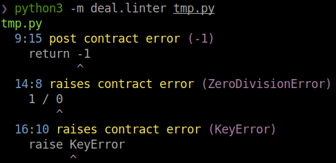

# Linter

Deal can do static checks for functions with contracts to catch trivial mistakes. Don't expect it to find much. Static analysis in dynamic language is hard but deal tries its best to help you. Add the linter on your CI and it will help you to find bugs.

## flake8

Most probably, you already use [flake8](http://flake8.pycqa.org), so this option should suit best for you. Deal has built-in flake8 plugin which will be automatically discovered if you install flake8 and deal in the same environment.

```bash
python3 -m pip install --user flake8 deal
python3 -m flake8
```

## Built-in CLI command

Another option is to use built-in CLI from deal: `python3 -m deal lint`. I has beautiful colored output by default. Use `--json` option to get a compact JSON output. Pipe output into [jq](https://stedolan.github.io/jq/) to beautify JSON.

Since this is ad-hoc solution, it has a bit more beautiful colored output.



## Codes

General:

| Code    | Message |
| ------- | ------- |
| DEAL001 | do not use `from deal import ...`, use `import deal` instead |
| DEAL002 | ensure contract must have `result` arg |

Contracts:

| Code    | Message                   |
| ------- | ------------------------- |
| DEAL011 | pre contract error        |
| DEAL012 | post contract error       |
| DEAL013 | example violates contract |
| DEAL021 | raises contract error     |
| DEAL031 | assert error              |

Markers:

| Code    | Message                 |
| ------- | ----------------------- |
| DEAL041 | missed marker (global)  |
| DEAL042 | missed marker (import)  |
| DEAL043 | missed marker (io)      |
| DEAL044 | missed marker (read)    |
| DEAL045 | missed marker (write)   |
| DEAL046 | missed marker (stdout)  |
| DEAL047 | missed marker (stderr)  |
| DEAL048 | missed marker (network) |
| DEAL049 | missed marker (stdin)   |
| DEAL050 | missed marker (syscall) |
| DEAL055 | missed marker (random)  |
| DEAL056 | missed marker (time)    |

## Partial execution

To check `pre` and `post` contracts, linter can partially execute them. For example:

```python run
import deal

@deal.post(lambda r: r != 0)
def f():
    return 0
```

Try to run linter against the code above:

```bash
$ python3 -m deal lint tmp.py
tmp.py
  6:11 DEAL012 post contract error (0)
    return 0
```

Hence there are some rules to make your contracts linter-friendly:

+ Avoid side-effects, even logging.
+ Avoid external dependencies (functions and contants defined outside of the contract).
+ Keep them as small as possible. If you have a few different things to check, make separate contracts.

Linter silently ignores contract if it cannot be executed.
