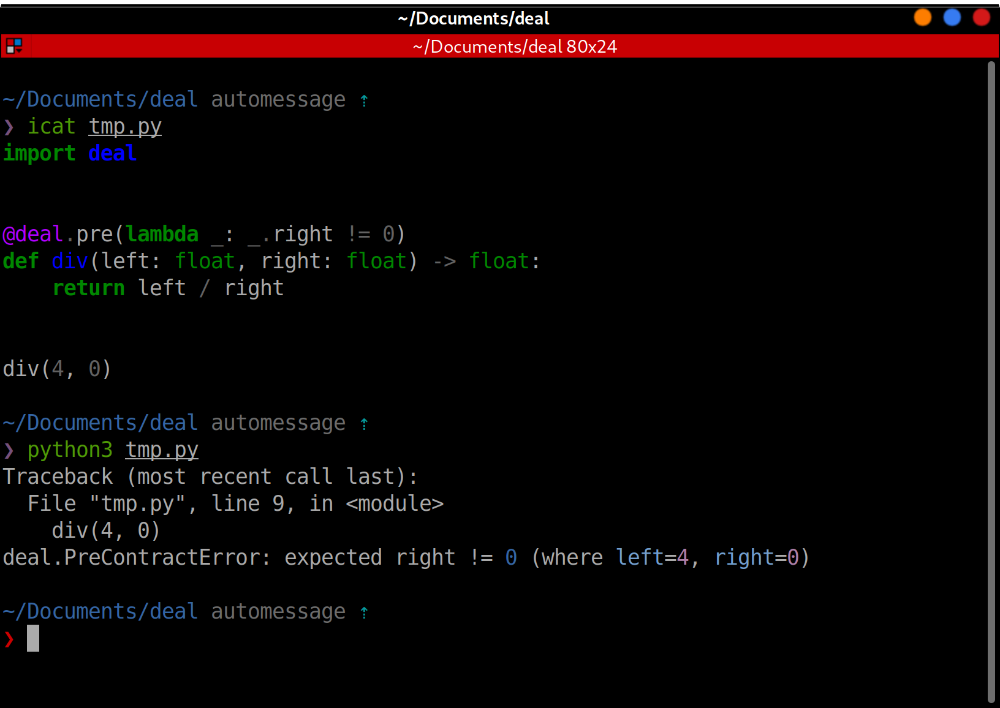

# Runtime

Call the functions, do usual tests, just play around with the application, deploy it to staging, and Deal will check contracts in runtime. On contract violation, deal raises an exception. In general, you shouldn't ever catch these exceptions because contracts must be never violated. Contract violation means a bug.



## Contracts on production

If you run Python with `-O` option, all contracts will be disabled. This is uses Python's `__debug__` variable:

> The built-in variable `__debug__` is True under normal circumstances, False when optimization is requested (command line option -O).
> Source: [Python documentation](https://docs.python.org/3/reference/simple_stmts.html#assert)

Also, you can explicitly enable or disable contracts:

```python
# disable all contracts
deal.disable()

# enable all contracts
deal.enable()

# restore the default behavior
# (enabled if `__debug__` is True, disabled otherwise)
deal.reset()
```

## Colors

If no error message or custom exception specified for a contract, deal will show contract source code and passed parameters as the exception message. By default, deal highlights syntax for this source code. If your terminal doesn't support colors (which is possible on CI), you can specify `NO_COLOR` environment variable to disable syntax highlighting:

```bash
export NO_COLOR=1
```

See [no-color.org](https://no-color.org/) for more details.
