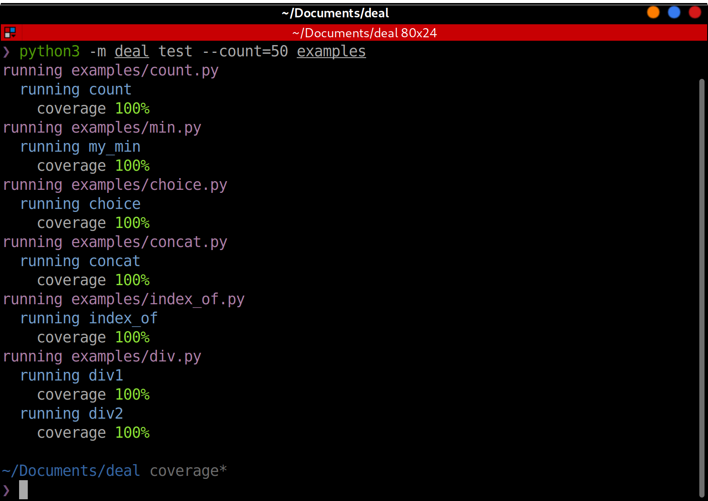

# Tests

Deal can automatically test your functions. First of all, your function has to be prepared:

1. All function arguments are type-annotated.
1. All exceptions that function can raise are specified in {py:func}`deal.raises`.
1. All preconditions are specified with {py:func}`deal.pre`.

```python run
@deal.raises(ZeroDivisionError)
@deal.pre(lambda a, b: a >= 0 and b >= 0)
def div(a: int, b: int) -> float:
    return a / b
```

Then you can use {py:func}`deal.cases` to generate test cases for the function. This is a polimorphic object that can be used in many ways.

Here is the shortest way to create a test:

```python
test_div = deal.cases(div)
```

It is enough for [pytest](https://docs.pytest.org/en/latest/) to find and run the test. Or you can run it manually by just calling it: `test_div()`.

However, it is not scalable. What if we want to use a pytest fixture? What if we need to prepare something before running the test case? Or what if we want to check additional conditions? So, let's make a proper test function:

```python
# type annotations below are optional
@deal.cases(div)
def test_div(case: deal.TestCase) -> None:
    case()
```

In this example, when we (or pytest) call `test_div()`, deal will generate test cases (using [hypothesis](https://hypothesis.readthedocs.io/en/latest/)) and run the function body for every case. The test function itself decides when to execute the test case. Here `case` is an instance of {py:class}`deal.TestCase` class. This form works as expected with pytest fixtures if the test case is the first argument and has the name `case`.

## CLI

There is a CLI command named `test`. It extracts `deal.pure` and `@deal.has()` (without arguments) wrapped functions and runs `deal.cases` powered tests for it.

```bash
python3 -m deal test project/*.py
```

The command is helpful when you don't have tests for some pure functions yet but want to get an early feedback.

For every ran function, deal calculates and shows coverage. This is a helpful indication on how good deal was at finding the correct input values.



## Configuring

Specify samples count (50 by default):

```python
deal.cases(div, count=20)
```

Explicitly specify arguments to pass into the function:

```python
deal.cases(div, kwargs=dict(b=3))
```

See {py:class}`deal.cases` API documentation and {doc}`/details/tests` for details.

## Practical example

The best case for Contract-Driven Development is when you have a clear business requirements for part of code. Write these requirements as contracts, and then write a code that satisfy these requirements.

In this example, we will implement `index_of` function that returns index of the given element in the given list. Let's think about requirements:

1. Function accepts list of elements (let's talk about list of integers), one element, and returns index.
1. Result is in range from zero to the length of the list.
1. Element by given index (result) is equal to the given element.
1. If there are more than one matching element in the list, we'll return the first one.
1. If there is no matching elements, we'll raise `LookupError`.

And now, let's convert it from words into the code:

```python run
from typing import List, NoReturn
import deal

# if you have more than 2-3 contracts,
# consider moving them from decorators into separate variable
# like this:
contract_for_index_of = deal.chain(
    # result is an index of items
    deal.post(lambda result: result >= 0),
    deal.ensure(lambda items, item, result: result < len(items)),
    # element at this position matches item
    deal.ensure(
        lambda items, item, result: items[result] == item,
        message='invalid match',
    ),
    # element at this position is the first match
    deal.ensure(
        lambda items, item, result: not any(el == item for el in items[:result]),
        message='not the first match',
    ),
    # LookupError will be raised if no elements found
    deal.raises(LookupError),
    deal.reason(LookupError, lambda items, item: item not in items),
    # no side-effects
    deal.has(),
)
```

Now, we can write a code that satisfies our requirements:

```python
@contract_for_index_of
def index_of(items: List[int], item: int) -> int:
    for index, el in enumerate(items):
        if el == item:
            return index
    raise LookupError
```

And tests, after all, the easiest part. Let's make it a little bit interesting and in the process show all valid samples:

```python
# test and make examples
@deal.cases(index_of, count=1000)
def test_div(case):
    # run test case
    result = case()
    if result is not NoReturn:
        # if no exceptions was raised, print the result
        print(f"index of {case.kwargs['item']} in {case.kwargs['items']} is {result}")
```
